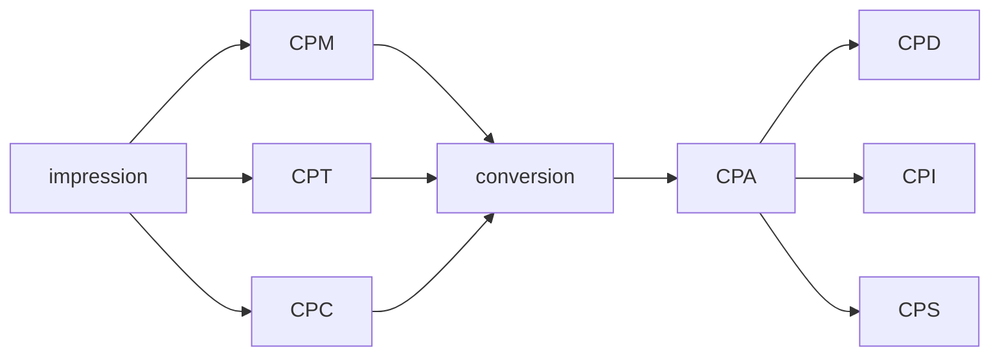
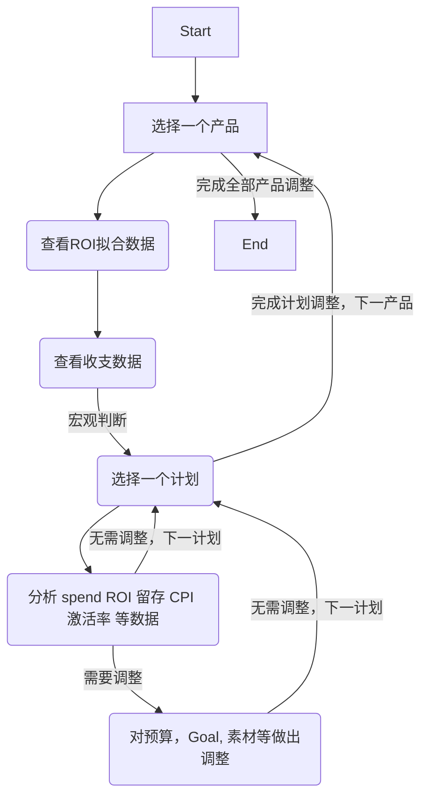

# AdOptimization Learning Notes I —— Job Description

文章创建于：2025年07月10日

最后编辑于：2025年07月22日

[TOC]

## 术语

后文中会用到的术语

|           NAme           | description  |
| :----------------------: | :----------: |
|  CPI : cost per install  | 单次安装费用 |
|  CPM : cost per million  | 千次展示费用 |
| CTR : click through rate |    点击率    |
|  CVR : conversion rate   |    转化率    |

$$
\text{CPI}=\frac{\text{cost}}{\text{install}}
$$

$$
\text{CPM}=\frac{\text{cost}}{\text{impression}}\times1000
$$

$$
\text{CTR}=\frac{\text{click}}{\text{impression}}
$$

$$
\text{CVR}=\frac{\text{install}}{\text{click}}
$$

联立上述4个式子，可得：

$$
\text{CPM}=\text{CPI}\cdot\text{CVR}\cdot\text{CTR}\times1000
$$

### 计费方式

## 归因

判断是什么原因促使用户下载应用，或激活应用后进行各种操作

可用于帮助广告主分析用户质量

自归因平台：

1. Google

2. Facebook

三方归因平台：

1. Aplovin

2. Unity

3. ...

### 由归因方式不同所产生的问题

## 市场调研

在市场调研部分，主要使用了[Appmagic](https://appmagic.rocks/), [Insightrackr](https://www.insightrackr.com/en/?referer=google_ads&from_type=marketing&source=google&campaign_id=22257792677&adgroup_id=175250869396&ad_id=733629641440&keyword=insightrackr&gad_source=1&gad_campaignid=22257792677&gclid=CjwKCAjwyb3DBhBlEiwAqZLe5BA_GWSQJ5tfyrQ7w8ePu2f6PXj4owx00cJ5rOqxsw2uSIQt9oeblRoCNd4QAvD_BwE), [Google Play](https://play.google.com/store/games)平台，对于其具体操作在本文中不做赘述。

> Appmagic: Tap into the deepest market insights with our unparalleled classification  system, exclusive advertising analysis, and trendspotting features.  Do`t just track your competitors—get ahead of them. One might say it is magic!
>
> Insightrackr: Insightrackr is a mobile marketing strategy analysis platform that  delivers real-time insights to fuel faster, smarter user growth.
>
> Google Play: *Google Play* gives you one place to find, enjoy, &  share Apps, Music, Movies & Books - instantly anywhere across the  web & android devices.

## 过数据

根据「过数文档」，依次查看每个产品的每个campaign，并对每个campaign做出相应决策，如何做决策不在本文中讨论。

## 素材

### 素材参考

从AppMagic中找到自家产品的竞品，找到体量最大的产品

在insightrackr上查找，按曝光量降序

素材的一般要求：

1. 简洁

2. 清晰

3. 时长20s～60s 

### 素材创意

要求：

1. 新颖

2. 有一定的曝光量

### 素材测试

通过投放平台后台数据，和三方归因平台数据定期对已投放的广告素材做出评估

评估指标：

1. 消耗占比

2. CPM

3. CTR

4. CVR

5. CPI

6. 留存（ret1 ret3 ret7 ...）

7. ROAS（roas3 roas7 roas15 ...） 

分析表现好坏的原因：

1. 表现形式

2. 。。。

> 素材数据测试详见[素材数据测试](/AdOptimization/AdOptimization%20Learning%20Notes%20III.markdown)

## 余额监控

每隔两周查看一次各产品的剩余预算与过去一周的消耗，需要保证剩余预算能够满足未来8周的消耗，避免因预算不足导致投放中止。

## ROI拟合数据记录

随着数据量的增加，预测模型能够更好的学习数据的特征和规律，模型的准确性和泛化能力也随之提升。故对于同一个campagin，在不同时期查看未来同一时刻的ROI预测的值也会有所不同。

需要每日记录ROI数据的拟合情况，便于未来复盘和分析模型的问题。