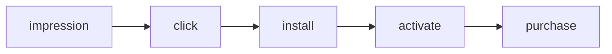
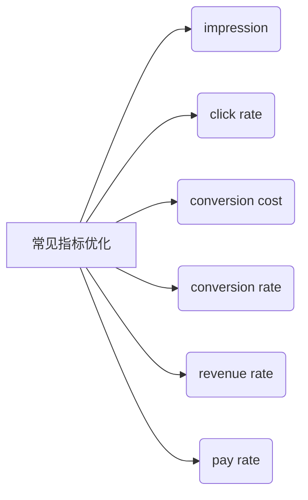

# AdOptimization Learning Notes II —— Go-to-Market Strategy

文章创建于：2025年07月14日

最后编辑于：2025年07月23日

[TOC]

## 市场调研

### 产品调研

#### 市场情况

1. 出现时间（什么时候出现，竞品什么时候开始涌入市场，有多少竞品，都是谁在做，增长量如何，市场潜力如何）
2. 玩法（创新与否）
3. 在双端上的情况都要考虑

#### 投放情况

1. 大体量的产品有哪些，都是来自于什么公司
2. 在不同投放渠道的表现如何

#### 素材情况

1. 曝光如何
2. 题材是什么

### 竞品公司分析

#### 竞品分析

1. 什么时候弹出banner

2. 什么时候插屏

3. 激励

4. 关卡内容

5. 特殊关卡

6. 难度

7. 每日挑战

8. 关卡画面

9. 特殊玩法

10. 素材复用情况

#### 竞品公司投放策略分析

## 数据指标优化

### 信息流广告链路

### 常见指标优化

## 不同广告平台的异同

