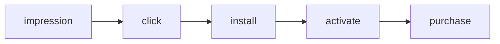
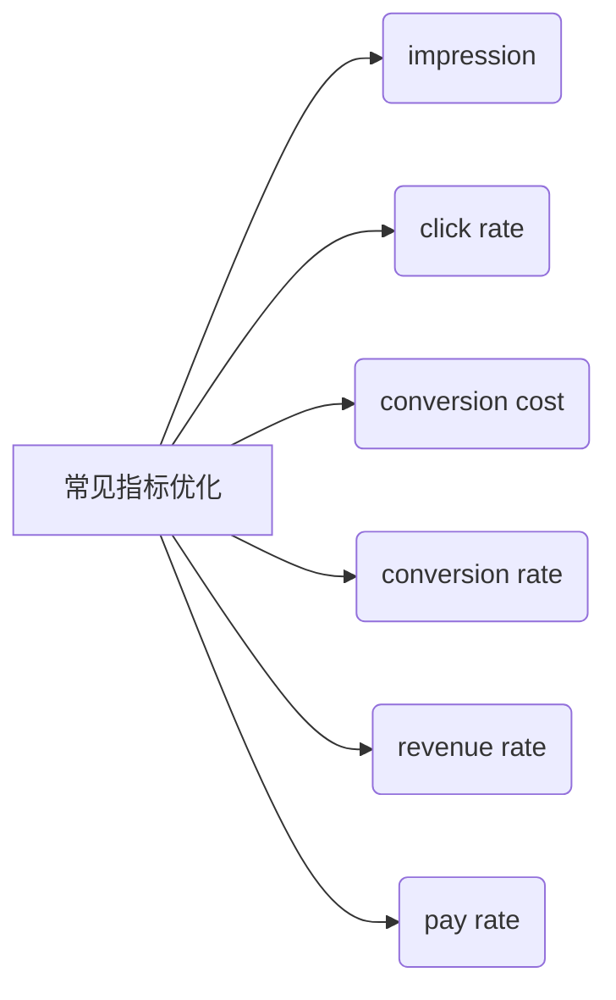

# AdOptimization Learning Notes II —— Go-to-Market Strategy

文章创建于：2025年07月14日

最后编辑于：2025年07月22日

[TOC]

## 数据指标优化

### 信息流广告链路

```mermaid
graph LR
impression[impression] --> click[click]
click[click] --> install[install]
install --> activate[activate]
activate --> purchase 
```

### 常见指标优化

```mermaid
graph LR
1[常见指标优化] --> 11(impression)
1[常见指标优化] --> 12(click rate)
1[常见指标优化] --> 13(conversion cost)
1[常见指标优化] --> 14(conversion rate)
1[常见指标优化] --> 15(revenue rate)
1[常见指标优化] --> 16(pay rate)
```

## 不同广告平台的异同

