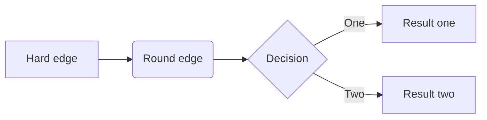

# AdOptimization Learning Notes I

[TOC]

> 

## 术语

后文中会用到的术语

|           NAme           | description  |
| :----------------------: | :----------: |
|  CPI : cost per install  | 单次安装费用 |
|  CPM : cost per million  | 千次展示费用 |
| CTR : click through rate |    点击率    |
|  CVR : convertion rate   |    转化率    |
|                          |              |

$$
\text{CPI}=\frac{\text{cost}}{\text{install}}
$$

$$
\text{CPM}=\frac{\text{cost}}{\text{impression}}\times1000
$$

$$
\text{CTR}=\frac{\text{click}}{\text{impression}}
$$

$$
\text{CVR}=\frac{\text{install}}{\text{click}}
$$

联立上述4个式子，可得：

$$
\text{CPM}=\text{CPI}\cdot\text{CVR}\cdot\text{CTR}\times1000
$$

## 归因

## 市场调研

在市场调研部分，主要使用了[Appmagic](https://appmagic.rocks/), [Insightrackr](https://www.insightrackr.com/en/?referer=google_ads&from_type=marketing&source=google&campaign_id=22257792677&adgroup_id=175250869396&ad_id=733629641440&keyword=insightrackr&gad_source=1&gad_campaignid=22257792677&gclid=CjwKCAjwyb3DBhBlEiwAqZLe5BA_GWSQJ5tfyrQ7w8ePu2f6PXj4owx00cJ5rOqxsw2uSIQt9oeblRoCNd4QAvD_BwE), [Google Play](https://play.google.com/store/games)平台，对于其具体操作在本文中不做赘述。

> Appmagic: Tap into the deepest market insights with our unparalleled classification  system, exclusive advertising analysis, and trendspotting features.  Do`t just track your competitors—get ahead of them. One might say it is magic!
>
> Insightrackr: Insightrackr is a mobile marketing strategy analysis platform that  delivers real-time insights to fuel faster, smarter user growth.
>
> Google Play: *Google Play* gives you one place to find, enjoy, &  share Apps, Music, Movies & Books - instantly anywhere across the  web & android devices.

## 过数据

根据「过数文档」，依次查看每个产品的每个campaign

