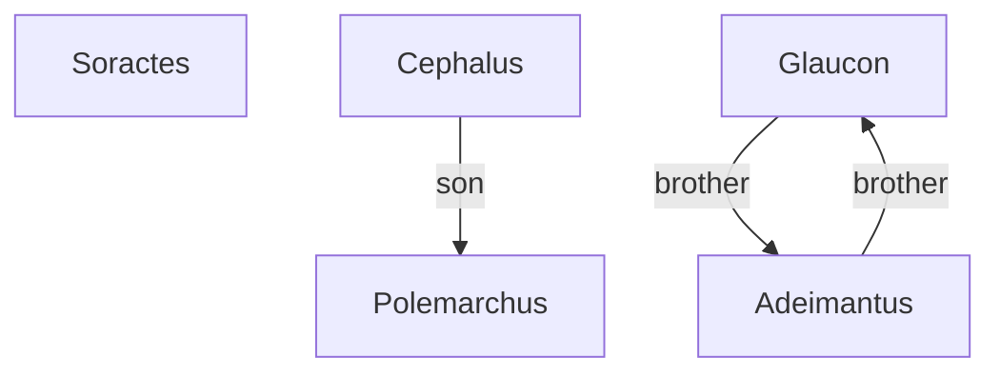

# The Republic

## Writter

PLATO(c.427-347 BC)

## Character Relationships

```mermaid
graph
    Soractes
    Cephalus -->|son| Polemarchus
    Glaucon -->|brother| Adeimantus
    Adeimantus -->|brother| Glaucon
```
