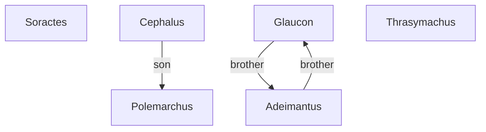

# The Republic

# CONTENT

- [PART I ONE INTRODUCTION](PART_ONE.md)

## Writer

PLATO(c.427-347 BC)

## Character Relationships

SOCRATERS,narrator.

GLAUCON and ADEIMANTUS, sole respondents in the dialogue after Book i. Elder brothers of Plato.

POLEMARCHUS, a resident in Piraeus, the port of Athens: the dialogue takes place at his house.

CEPHALUS, a Syracusan by birth, Polemarchus’ father and apparently resident with him. Respondent in the early part of the dialogue until his place is taken by Polemarchus.

TRARSYMACHUS OF CHALCEDON, sophist and orator, the main respondent in Book i.

LYSIAS and EUTHYDEMUS, Polemarchus’ brothers. Lysias became an orator and speech-writer, note for the purity of his style; a number of his speeches are still extant(e.g. ‘Against Eratosthenes’ in *Greek Political Oratory*, trans. A. N. W. Saunders: Penguin, 1970). NICERATUS, son of Nicias the Athenian statesman and general. CHARMANTIDES and CLEITOPHON, of whom we otherwise know nothing. The only one of this last group to speak in the dialogue is Cleitophon, and his is the briesfest interjection(340).

The dramatic date of the dialogue is commonly supposed to be just before 420 BC, when Socrates would be about fifty.

## Polity

- 君主政体 –> 僭主政体
- 贵族政体 –> 寡头政体
- 共和政体 –> 平民政体 

## Sentence

The unexamined life is not worth living.
